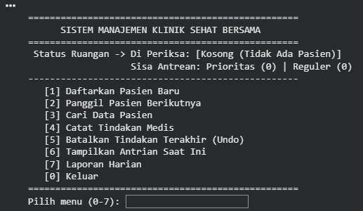
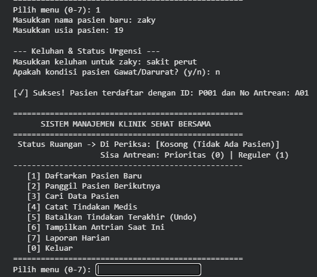
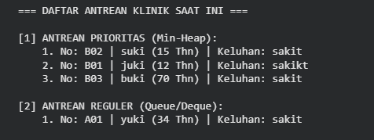
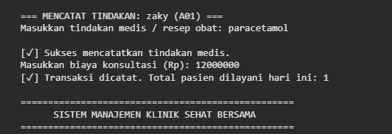
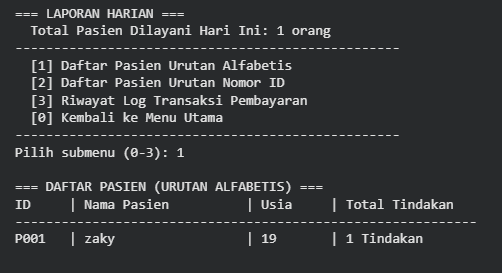

# 🏥 Clinic Queue Management System

<p align="center">


</p>

---

# 📖 Overview

The **Clinic Queue Management System** is a console-based application developed in **Python** to simulate the workflow of a healthcare clinic.

This project demonstrates the practical implementation of several **Data Structures** in solving real-world problems, including patient registration, queue management, medical treatment recording, payment logging, and daily reporting.

---

# ✨ Features

- 👤 Register new patients
- 🚨 Priority queue for emergency patients
- 👴 Elderly patient prioritization
- 📋 Regular patient queue
- 🔍 Search patient information
- ✏️ Update patient data
- 🩺 Record medical treatments
- ↩️ Undo the latest treatment
- 💰 Payment transaction logging
- 📊 Daily reports
- 📈 Real-time clinic dashboard
- ✅ Input validation

---

# 🛠 Tech Stack

<p align="center">


</p>

---

# 📚 Data Structures Used

| Data Structure | Purpose |
|----------------|---------|
| 📖 Hash Table (`dict`) | Store patient master data with fast lookup |
| 📋 Queue (`deque`) | Manage regular patient queue |
| 🚨 Priority Queue (`heapq`) | Prioritize emergency and elderly patients |
| 📚 Stack (`list`) | Store medical history and support Undo |
| 📄 List | Store patient records |
| 🔄 Timsort | Sort daily reports by patient name or ID |

---

# ⚙️ System Workflow

```text
Patient Registration
        │
        ▼
Emergency Patient?
   │
 ┌─┴──────────┐
 │            │
Yes          No
 │            │
 ▼            ▼
Priority Queue   Regular Queue
       │
       ▼
Doctor Examination
       │
       ▼
Medical Treatment
       │
       ▼
Payment Transaction
       │
       ▼
Daily Report
```

---

# 📸 Application Preview

## 🏠 Main Menu

<p align="center">
  
</p>

The dashboard provides a real-time overview of the clinic, including the current patient being examined, remaining queues, and available menu options.

---

## 👤 Patient Registration

<p align="center">
  
</p>

Patients can be registered by entering personal information, medical complaints, and emergency status. The system automatically places them into the appropriate queue.

---

## 📋 Queue Management

<p align="center">
  
</p>

Patients are separated into **Priority Queue (Heap)** and **Regular Queue (Deque)** based on emergency status and age.

---

## 🩺 Medical Procedure

<p align="center">
  
</p>

Doctors can record treatments, prescriptions, and consultation fees. Medical records are stored using a **Stack**, allowing the latest treatment to be undone.

---

## 📊 Daily Report

<p align="center">
  
</p>

Generate reports showing patient information, transaction history, and sorted patient data.

---
# 📂 Project Structure

```text
Clinic-Queue-Management-System
│
├── assets
│   ├── Clinic-Menu.png
│   ├── Clinic-Registration.png
│   ├── Clinic-Queue.png
│   ├── Medical-Procedure.png
│   ├── Clinic-Report.png
│
├── main.py
├── README.md
├── LICENSE
└── .gitignore
```

---

# 🚀 Getting Started

## Clone Repository

```bash
git clone https://github.com/Zaky-not/Clinic-Queue-Management-System.git
```

## Open Project

```bash
cd Clinic-Queue-Management-System
```

## Run Application

```bash
python main.py
```

---

# 📈 Time Complexity

| Operation | Complexity |
|-----------|------------|
| Register Patient | O(1) |
| Search Patient | O(1) |
| Add Regular Queue | O(1) |
| Add Priority Queue | O(log n) |
| Call Priority Patient | O(log n) |
| Call Regular Patient | O(1) |
| Undo Treatment | O(1) |
| Daily Report Sorting | O(n log n) |

---

# 🚀 Future Improvements

- 🗄 Database Integration (MySQL/PostgreSQL)
- 🖥 Graphical User Interface (GUI)
- 📅 Appointment Scheduling
- 👨‍⚕️ Multi-Doctor Support
- 🔐 Authentication & User Roles
- 📄 Export Reports to PDF
- 🌐 Web-Based Version

---

# 👨‍💻 Author

**Muhammad Albar Al-Zaky**

🎓 Informatics Student — Universitas Jambi

### Interests

- Cyber Security
- Artificial Intelligence
- Backend Development
- Networking

---

<div align="center">

### ⭐ If you found this project useful, please consider giving it a star!

Made with ❤️ using Python

</div>
